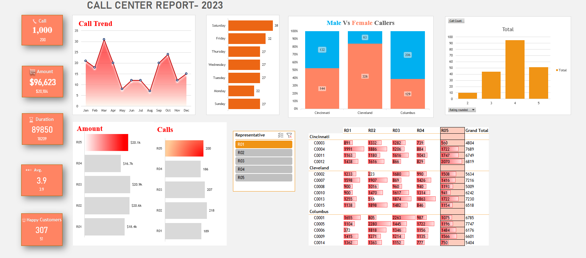
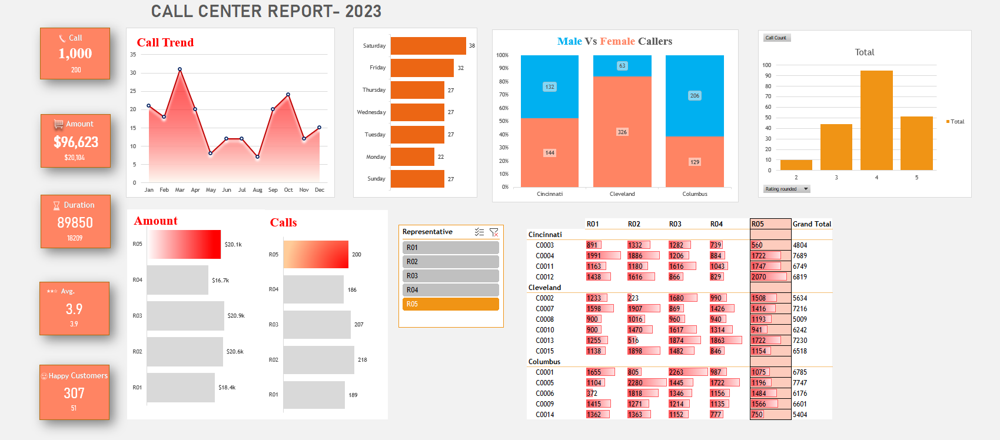

# Call Center Performance Dashboard — Excel

An interactive Excel dashboard designed to evaluate call center performance across call volume, purchase value, call duration, customer satisfaction, representative performance, customer activity, and demographics.

| Project Type | Business Analytics Dashboard |
|---|---|
| Tool | Microsoft Excel |
| Year | 2023 |
| Records Analyzed | 1,000 calls |
| Representatives | 5 |
| Customers | 15 |
| Cities | 3 |
---

## Executive Summary

This project analyzes **1,000 call-center interactions recorded during 2023** to understand operational activity, representative performance, customer satisfaction, purchasing behavior, and call patterns.

The analysis combines call-level data with customer information and transforms the data into an interactive Excel reporting environment using **Power Query, Excel formulas, PivotTables, PivotCharts, conditional formatting, and slicers**.

The final dashboard allows users to explore overall performance and dynamically filter representative-level metrics.

### Key Results

| KPI                         |             Result |
| --------------------------- | -----------------: |
| Total Calls                 |          **1,000** |
| Total Purchase Amount       |        **$96,623** |
| Total Call Duration         |         **89,850** |
| Average Satisfaction Rating |       **3.89 / 5** |
| 5-Star Calls                |            **307** |
| Calls with Rating 4 or 5    |    **735 (73.5%)** |

---

## Business Objective

The objective of this project is to answer a practical management question:

> **How is the call center performing, which representatives are driving results, and where are the strongest patterns in customer activity and satisfaction?**

The dashboard was designed to help a manager quickly evaluate:

* call volume and trends
* representative workload and purchase contribution
* customer satisfaction
* daily and monthly call patterns
* geographic and gender-based call patterns
* customer-level purchasing activity

---

## Business Questions & Findings

### 1. How many calls were handled during 2023?

**Answer:** **1,000 calls** were recorded during the year.

These calls generated **$96,623 in purchase amount** with an overall average satisfaction rating of **3.89/5**.

---

### 2. Which month had the highest call volume?

**Answer:** **March recorded the highest call volume with 155 calls.**

The lowest monthly volume occurred in **August with 50 calls**.

This indicates substantial variation in call activity across the year, with March representing the strongest period and August the weakest.

| Month     |   Calls |
| --------- | ------: |
| March     | **155** |
| April     |     136 |
| October   |     114 |
| January   |      79 |
| September |      76 |
| June      |      67 |
| February  |      66 |
| July      |      64 |
| November  |      57 |
| December  |      53 |
| May       |      83 |
| August    |  **50** |

---

### 3. Which day of the week receives the most calls?

**Answer:** **Saturday had the highest call volume with 161 calls.**

**Thursday had the lowest with 128 calls.**

| Day       |   Calls |
| --------- | ------: |
| Saturday  | **161** |
| Wednesday |     153 |
| Sunday    |     146 |
| Friday    |     141 |
| Tuesday   |     138 |
| Monday    |     133 |
| Thursday  | **128** |

The distribution suggests that call demand is not evenly distributed across the week, which could be relevant when planning representative staffing.

---

### 4. Which representative handles the most calls?

**Answer:** **R02 handles the most calls with 218.**

| Representative |   Calls |
| -------------- | ------: |
| R02            | **218** |
| R03            |     207 |
| R05            |     200 |
| R01            |     189 |
| R04            | **186** |

R02 therefore handles the highest workload in terms of call volume.

---

### 5. Which representative generates the highest purchase amount?

**Answer:** **R03 generates the highest purchase amount at $20,872.**

| Representative | Purchase Amount |
| -------------- | --------------: |
| R03            |     **$20,872** |
| R02            |         $20,581 |
| R05            |         $20,104 |
| R01            |         $18,415 |
| R04            |     **$16,651** |

An important observation is that **the representative handling the most calls is not the representative generating the most purchase value**.

R02 leads in call volume, while R03 leads in purchase amount.

---

### 6. Which representative generates the most purchase amount per call?

Using purchase amount divided by number of calls:

| Representative | Purchase / Call |
| -------------- | --------------: |
| R03            |     **$100.83** |
| R05            |         $100.52 |
| R01            |          $97.43 |
| R02            |          $94.41 |
| R04            |      **$89.52** |

R03 produces the highest average purchase amount per call, while R04 has the lowest.

This provides a useful perspective beyond call volume alone: **activity and value contribution are not necessarily the same thing.**

---

### 7. How is customer satisfaction distributed?

The overall average satisfaction rating is **3.89/5**.

Out of 1,000 calls:

* **307** received a rounded rating of 5
* **428** received a rounded rating of 4
* **197** received a rounded rating of 3
* **59** received a rounded rating of 2
* **8** received a rounded rating of 1
* **1** received a rounded rating of 0

Therefore, **735 calls (73.5%) received a rating of 4 or 5**.

The strongest concentration is around ratings **4 and 5**, indicating generally positive customer feedback across the dataset.

---

### 8. Which city generates the highest call volume and purchase amount?

**Answer:** **Cleveland** has the highest call volume and purchase amount.

| City       |   Calls | Purchase Amount |
| ---------- | ------: | --------------: |
| Cleveland  | **389** |     **$37,849** |
| Columbus   |     335 |         $32,713 |
| Cincinnati |     276 |         $26,061 |

Cleveland accounts for the largest share of activity in both measures.

---

### 9. How does caller gender vary across cities?

The dashboard shows clear differences in call composition by city.

| City       | Female Calls | Male Calls |
| ---------- | -----------: | ---------: |
| Cincinnati |          144 |        132 |
| Cleveland  |      **326** |         63 |
| Columbus   |          129 |    **206** |

Cleveland is strongly female-dominated in call volume, while Columbus shows the opposite pattern, with substantially more male calls.

This is based on **call volume**, not unique customers.

---

### 10. Which customers contribute the highest purchase amounts?

The highest-value customers by total purchase amount are:

| Customer | Purchase Amount |  Calls |
| -------- | --------------: | -----: |
| C0005    |      **$7,747** |     79 |
| C0004    |          $7,689 | **82** |
| C0013    |          $7,230 |     69 |
| C0007    |          $7,216 |     67 |
| C0012    |          $6,819 |     70 |

C0004 has the highest call frequency, while C0005 generates the highest total purchase amount.

Again, **the customer with the most interactions is not necessarily the customer generating the highest value**.

---

### 11. How long are customers typically spending on calls?

The call-duration distribution is:

| Duration Bucket   |   Calls |
| ----------------- | ------: |
| 1 to 2 hours      | **524** |
| More than 2 hours |     237 |
| 30 to 60 minutes  |     179 |
| 10 to 30 minutes  |      51 |
| Under 10 minutes  |       9 |

**761 out of 1,000 calls (76.1%) lasted more than one hour.**

This suggests that a large proportion of the call center's workload involves relatively long customer interactions.

---

## Dashboard Preview

### Overall Dashboard



### Interactive Representative Analysis



The representative slicer allows the dashboard to be filtered interactively so that selected representative metrics can be compared against overall call-center performance.

---

## Dashboard Components

The final dashboard combines several analytical views into a single management-facing report:

* Total call volume
* Total purchase amount
* Total call duration
* Average satisfaction rating
* 5-star count
* Monthly call trend
* Calls by day of week
* Caller gender distribution by city
* Satisfaction rating distribution
* Representative purchase performance
* Representative call volume
* Customer-level representative activity
* Interactive representative slicer

---

## Analytical Workflow

The project follows a structured Excel analysis workflow:

```text
Raw Call & Customer Data
        ↓
Data Preparation with Power Query
        ↓
Calculated Fields & Excel Formulas
        ↓
PivotTables & Aggregations
        ↓
PivotCharts & Conditional Formatting
        ↓
Interactive Dashboard
        ↓
Business Findings & Performance Analysis
```

---

## Excel Techniques Used

### Data Preparation

* Power Query
* Data cleaning and transformation
* Data organization
* Derived fields
* Date-based fields
* Duration buckets
* Rounded satisfaction ratings

### Formulas

* `SUMIF / SUMIFS`
* `COUNT / COUNTIFS`
* `AVERAGE`
* `IF`
* Other supporting calculations used to answer business questions

### Analysis & Reporting

* PivotTables
* PivotCharts
* Slicers
* Conditional Formatting
* KPI cards
* Interactive filtering
* Dashboard layout and reporting design

---

## Workbook Structure

The workbook is organized into separate layers for source data, supporting assets, analysis, and presentation.

| Sheet                    | Purpose                                          |
| ------------------------ | ------------------------------------------------ |
| `customers`              | Customer demographic information                 |
| `calls`                  | Call-level data and supporting calculated fields |
| `pivots`                 | PivotTables and supporting analytical summaries  |
| `Assets`                 | Supporting dashboard assets                      |
| `Customer Centre Report` | Final interactive management dashboard           |

---

## Key Takeaways

Several patterns stand out from the analysis:

**R02 has the highest workload**, handling 218 calls, but **R03 generates the highest purchase amount**, showing that call volume and commercial value are not identical measures of performance.

**R04 records the lowest call volume and purchase amount among the five representatives, while also having the lowest purchase amount per call.

**March is the busiest month**, while August has the lowest call volume.

**Saturday is the busiest day of the week**, suggesting that staffing requirements may vary meaningfully throughout the week.

**Cleveland is the strongest city by both call volume and purchase amount**, while its call activity is heavily female-dominated.

**Customer satisfaction is generally positive**, with 73.5% of all calls receiving a rounded rating of 4 or 5.

**Long-duration calls dominate the workload**, with 76.1% lasting more than one hour.

---

## Data Quality Note

The source data contains one recorded satisfaction rating of **0.0**, which appears as a rounded rating of 0 in the underlying analysis.

This value was retained rather than silently removed so that the analysis remains faithful to the source dataset.

---

## Project Outcome

This project demonstrates how Excel can be used to move from **raw operational data to a management-facing analytical report**.

The main focus was not only on creating charts, but on connecting:

**business questions → data preparation → analysis → visualization → interpretation**

The result is an interactive dashboard that allows users to move between overall call-center performance and representative-level performance.

---

## Learning Context

This project was completed as part of my hands-on Excel learning journey using a guided project/tutorial by **Chandoo**.

The project was used to learn and apply practical Excel analysis techniques including Power Query, formulas, PivotTables, PivotCharts, slicers, conditional formatting, and dashboard design.

The implementation was performed hands-on throughout the learning process, with the goal of understanding how the individual Excel techniques combine into a complete business analysis workflow.

---

## Skills Demonstrated

**Microsoft Excel · Power Query · Data Cleaning · Excel Formulas · PivotTables · PivotCharts · Slicers · Conditional Formatting · Dashboard Design · KPI Reporting · Business Analysis · Data Visualization · Insight Generation**
